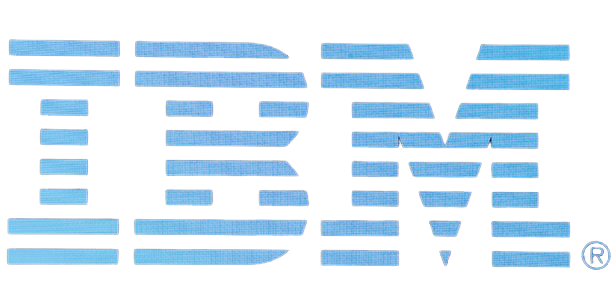

## Bout me <3
~~~

  👋 Hi, I’m @nduc4nh </li>
  👀 I’m interested in Science and Tech </li>
  🌱 I’m currently learning Computer Science </li>
  📫 Big love with Math and some silly stuffs </li>

~~~

&nbsp;  

## Internship & work <3
 
 
  

  <!---
nduc4nh/nduc4nh is a ✨ special ✨ repository because its `README.md` (this file) appears on your GitHub profile.
You can click the Preview link to take a look at your changes.
--->
